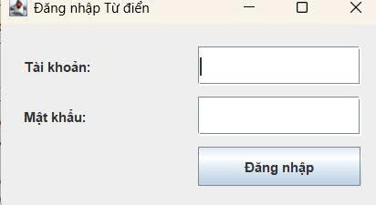
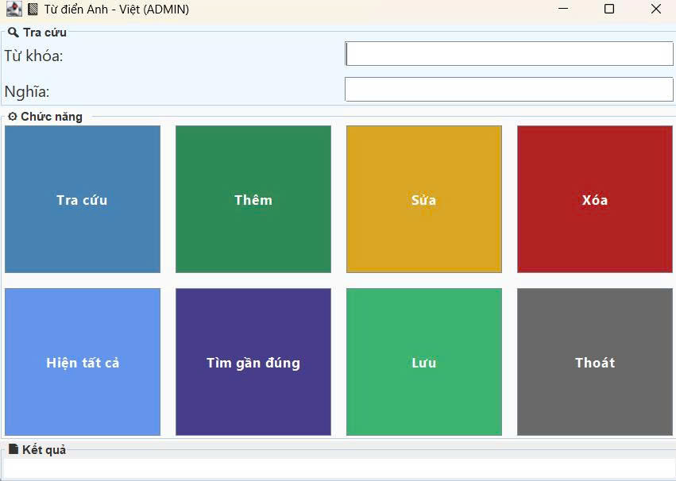

<h2 align="center">
    <a href="https://dainam.edu.vn/vi/khoa-cong-nghe-thong-tin">
    🎓 Faculty of Information Technology (DaiNam University)
    </a>
</h2>
<h2 align="center">
   TRA CỨU TỪ ĐIỂN ANH-VIỆT
</h2>
<div align="center">
    <p align="center">
        
        
        
    </p>

[](https://www.facebook.com/DNUAIoTLab)
[](https://dainam.edu.vn/vi/khoa-cong-nghe-thong-tin)
[](https://dainam.edu.vn)

</div>
## 📖 Giới thiệu  

Đề tài **Tra cứu Từ điển Anh – Việt** được xây dựng dựa trên mô hình **Client/Server** bằng **lập trình mạng với Socket**.  
Hệ thống cho phép người dùng (Client) nhập từ tiếng Anh cần tra cứu và nhận về nghĩa tiếng Việt từ phía Server.  

### 🎯 Mục tiêu  
- Củng cố kiến thức về **lập trình mạng** và **giao tiếp Socket**.  
- Vận dụng mô hình **Client/Server** trong thực tế.  
- Xây dựng công cụ hỗ trợ **học tập và tra cứu từ vựng tiếng Anh** nhanh chóng, dễ sử dụng.  

### ⚡ Chức năng chính  
- Người dùng nhập từ tiếng Anh và nhận kết quả dịch nghĩa tiếng Việt.  
- Giao tiếp Client/Server qua Socket để truyền và nhận dữ liệu.  
- Có thể mở rộng thêm các chức năng như:  
  - Gợi ý từ gần đúng khi nhập sai chính tả.  
  - Hiển thị nhiều nghĩa của từ.  
  - Hỗ trợ tra cứu song ngữ Anh – Việt và Việt – Anh.  
## 💻 Ngôn ngữ & Công cụ sử dụng  

- ☕ **Java** – Ngôn ngữ lập trình chính để xây dựng ứng dụng Client/Server.  
- 🖥️ **Eclipse IDE** – Môi trường phát triển tích hợp để viết và quản lý mã nguồn.
## 🚀 3. Hình ảnh các chức năng

<p align="center">
  
</p>

<p align="center">
  <em>Hình 1: Giao Diện Đăng Nhập</em>
</p>

<p align="center">
  
</p>
<p align="center">
  <em> Hình 2: Giao Diện Phần Mềm</em>
</p>
 ## 📝 4. Hướng dẫn cài đặt và sử dụng

### 🔧 Yêu cầu hệ thống

- **Java Development Kit (JDK)**: Phiên bản 8 trở lên
- **Hệ điều hành**: Windows, macOS, hoặc Linux
- **Môi trường phát triển**: IDE (IntelliJ IDEA, Eclipse, VS Code) hoặc terminal/command prompt
- **Bộ nhớ**: Tối thiểu 512MB RAM
- **Dung lượng**: Khoảng 10MB cho mã nguồn và file thực thi

## 📝 4. Hướng dẫn cài đặt và sử dụng

#### Bước 1: Chuẩn bị môi trường
1. **Kiểm tra Java**: Mở terminal/command prompt và chạy:
   ```bash
   java -version
   javac -version
   ```
   Đảm bảo cả hai lệnh đều hiển thị phiên bản Java 8 trở lên.

2. **Tải mã nguồn**: Sao chép thư mục `TraCuuTuDienAnhViet` chứa các file:
   - `MayChuTuDien.java`
   - `GiaoDienDangNhap.java`
   - `GiaoDienTuDien.java`
   - `MayKhachTuDien.java`
   - `XuLiKhach.java`
   #### Bước 2: Biên dịch mã nguồn
1. **Mở terminal** và điều hướng đến thư mục chứa mã nguồn
2. **Biên dịch các file Java**:
   ```bash
   javac UngDungChat_TCP/*.java
   ```
3. **Kiểm tra kết quả**: Nếu biên dịch thành công, sẽ tạo ra các file `.class` tương ứng.

#### Bước 3: Chạy ứng dụng

**Khởi động Server:**
```bash
java UngDungChat_TCP.Server
```
- Server sẽ khởi động trên port mặc định (888)
- Sẵn sàng nhận yêu cầu tra cứu từ client
- Server sẽ đọc dữ liệu từ file TuDien.txt
**Khởi động Client:**
```bash
java TraCuuTuDienAnhViet.Client
```
- Mở terminal mới cho mỗi client
- Client sẽ kết nối đến server và hiển thị giao diện tra cứu từ điển
### 🚀 Sử dụng ứng dụng

1.  Nhập từ cần tra cứu: Gõ từ tiếng Anh vào ô nhập
2. Xem kết quả: Nghĩa tiếng Việt của từ sẽ hiển thị trên màn hình
3.Không tìm thấy từ: Nếu từ không có trong từ điển, client sẽ nhận thông báo "Từ không tồn tại trong cơ sở dữ liệu"
### ⚠️ Lưu ý quan trọng

- Thứ tự khởi động: Luôn chạy Server trước rồi mới chạy Client
- Port: Đảm bảo port 12345 không bị ứng dụng khác chiếm
- Firewall: Có thể cần cấu hình firewall để cho phép kết nối
- Mạng: Server và Client phải cùng mạng hoặc có thể truy cập được IP của nhau
- Cơ sở dữ liệu từ điển: File TuDien.txt phải tồn tại trong thư mục chứa Server
## Thông tin liên hệ  
Họ tên: Ngô Ngọc Phú.  
Lớp: CNTT 16-03.  
Email: ngophu281004@gmail.com.

© 2025 AIoTLab, Faculty of Information Technology, DaiNam University. All rights reserved.

---
